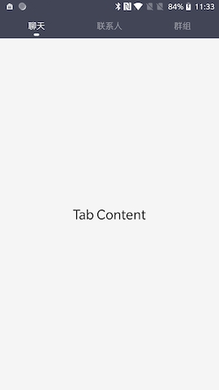

## KsTabPager
> 项目中用到，其他开源的感觉太重了，就自己写了个，封装了ViewPager

## 用法

1. 第一步 添加 JitPack 到 build 文件

```
allprojects {
		repositories {
			...
			maven { url 'https://jitpack.io' }
		}
	}

```

2. 第二步 添加依赖 [](https://jitpack.io/#KevinSuo/KsTabPager)

```groovy
	dependencies {
	        implementation 'com.github.KevinSuo:KsTabPager:v0.0.1'
	}
```
            
3. 在代码中使用

```xml
<com.kevinsuo.kstabpager.TabPager
      android:id="@+id/tab_pager"
      android:layout_width="match_parent"
      android:layout_height="match_parent"
      app:indicator_color="@color/white"
      app:indicator_display="true"
      app:indicator_width="10dp"
      app:title_bar_background="@color/tab_pager_header_background"
      app:title_text_color="@color/white"
      app:title_text_size="16sp"
      />
``` 

```java
 TabPager tabPager = findViewById(R.id.tab_pager);

 tabPager.useChildFragmentManager(fragment); // 如果控件在fragment中使用 调用此方法切换FragmentManager

 tabPager.setItems(new TabPager.TabPagerItemBuilder()
              .addItem(TabPager.TabPagerItem.build("聊天", TabFragment.class))
              .addItem(TabPager.TabPagerItem.build("联系人", TabFragment.class))
              .addItem(TabPager.TabPagerItem.build("群组", TabFragment.class)));
```



